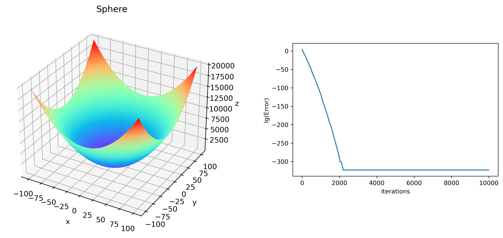

# PSO-ALS
Reproduction of the paper *Particle swarm optimization with adaptive learning strategy* (and *Clustering by fast search and find of density peaks*).

## Introduction

This paper introduce a  particle swarm optimization with the following features:

- multiswarm technique
- adaptive learning strategy
- maintain great diversity
- without an explicit velocity

## Density-based clustering 

Cluster centers are characterized by

1. a higher density than their neighbor
2. a relatively large distance from point with higher densities

### Data point property

1. local density $ρ_i$
2. minimum distance to any other point with higher density $δ_i$

### Local density

1. Cut-off kernel $ρ_i=∑_{(j∈I)}χ(d_ij-d_c ) $
2. Gaussian kernel $ρ_i=∑_{j∈I-{i}} exp⁡(-(d_ij/d_c )^2$

## SubSwarm Technique

Based on a cluster method published in *Science*. their algorithm divides the whole swarm into several subswarms. The best particles in subswarm behave differently from other particles.

### Locally best particle

1. one is the best particle in the subswarm
2. guide the learning in that subswarm
3. exploring information from other subswarms
4. further increase the population diversity

$$
x_i^d = ωx_i^d + c_1 rand_1^d (pBest_i^d - x_i^d ) +c_2 rand_2^d (1/C∑cgBest_c^d-x_i^d)
$$

### Ordinary particles

1. the remaining particles
2. exploiting the search space 
3. enhance the population diversity

$$
x_i^d = ωx_i^d + c_1 rand_1^d (pBest_i^d - x_i^d )+c_2 rand_2^d (cgBest_c^d - x_i^d)
$$

## Performance

In my own code, this algorithm has good performance on unimodal problems and multimodal problems. 

### Sphere D=30

### Schwefel D=30

## Summary

1. the whole swarm is adaptively clustered into several subswarms
2. particles of different types are updated in accordance with different learning strategies
3. the global best value is obtained by comparing the fitness values of all of the locally best particles
4. the population diversity is maintained by means of a divide-and-conquer approach

## Reference

[1] Zhang Y ,  Liu X ,  Bao F , et al. Particle swarm optimization with adaptive learning strategy[J]. Knowledge-Based Systems, 2020, 196(3):105789.

[2] Rodriguez A ,  Laio A . Clustering by fast search and find of density peaks[J]. Science, 2014, 344(6191):1492.
